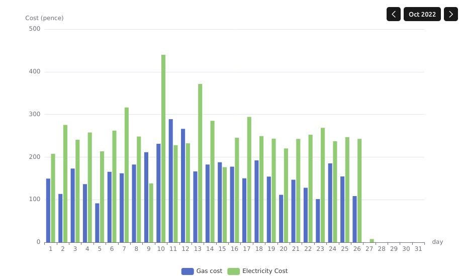

Glowmarkt API Binding
=====================

This binding allows import of Smart Meter data from the Hildebrand's [Glowmarkt API](https://glowmarkt.com/).
The information here is similar to what can be obtained using their Bright app. 
You can use this to get your historic meter data from DCC. 



Configuring
-----------

In order to use this binding, you will need to register for an account to use
the Glowmarkt API, and agree for them to import your Smart Meter data from DCC.

You will also need to install and configure an OpenHAB persistence service
that supports updating of past Item data via `ModifiablePersistenceService`.
The default RRD4J persistence service doesn't support this,
so you will need to use one of the other persistence services such as JDBC.

Once you have added the Glowmarkt API Bridge Thing, configure the User name and 
password for your Glowmarkt API access, and the name of your persistence service.

It should then discover the smart meter Virtual Entity Thing and it will appear 
in your Inbox. The Virtual Entity should then have the gas and electricity channels.

### Historic meter reading data

You will need to link items to the cost and consumption channels. Please note that 
the readings reported by the items linked to these channels will always read NULL
as current readings are never obtained. Instead, you should create charts against these
items in order to view the historic values once they are downloaded.

The binding will then attempt daily to download the gas and electricity meter readings.
Be aware this may take some time to complete.

### Current tariff information

The binding will create channels that obtain the current standing charge and per-unit tariffs 
for gas and electricity. Unlike the meter reading data, historic data for these values 
is not available and the current values are reported directly in items linked to the
channels in the normal way.

Supported Channels
------------------

* Gas Consumption
* Gas Cost
* Electricity Consumption
* Electricity Cost
* Gas Standing Charge
* Gas Per Unit Rate
* Electricity Standing Charge
* Electricity Per Unit Rate

The downloaded data is at 30-minute interval resolution, and it will download all the data 
that it can find. Every 24 hours it will download any new data it doesn't already have.

Example Chart Configuration
---------------------------

To create a chart like that shown above, first of all link the Gas cost and Electricity cost channels to some Number Point items.
You will then need to create a persistence configuration to ensure that the data can be saved.

### Persistence configuration (JDBC example)

You will need to have a supported database installed, such as MySQL, and then install the corresponding persistence addon
in Settings -> Other Add-ons -> JDBC Persistence {name of your database}.

Then create a persistence configuration file to configure the default persistence strategy for your items to use that 
persistence service. For example for JDBC, create in conf/persistence a `jdbc.persist` file:

```
Strategies {
}
Items {
        DCCSmartMeters_* : strategy = everyChange
}
```

### Chart creation

Then create a chart, go to Pages -> (+) Create Chart.
Select Chart Type = Month. Then configure axes:

### Y Axis (Value Axis)
Click Add Value Axis to create a Y axis, give it a name (like cost)
### X Axis (Category Axis)
Click Add Category Axis to create an X axis, give it a name (like day of month)

| Item | Setting      |
|------|--------------|
| Name | Day of month |
|Categories| Days of month|

### Data series
Click Add Aggregate series to add an aggregate series

| Item                                             | Setting                                     |
|--------------------------------------------------|---------------------------------------------|
| Name                                             | e.g. Gas cost                               |
| Item                                             | Your Gas Cost item                          |
| Type                                             | Bar                                         |
| First Dimension                                  | Day of Month                                |
| Aggregation Function                             | Sum                                         |
| Persistence Service (this is an advanced option) | persistence service you are using e.g. JDBC | 


Changelog
---------

### 4.0.1

* Add official support for OpenHAB 4.0
* Fixed #51 Glowmarkt binding not listed when attempting to add thing

#### 3.4.0

* Add official support for OpenHAB 3.4
